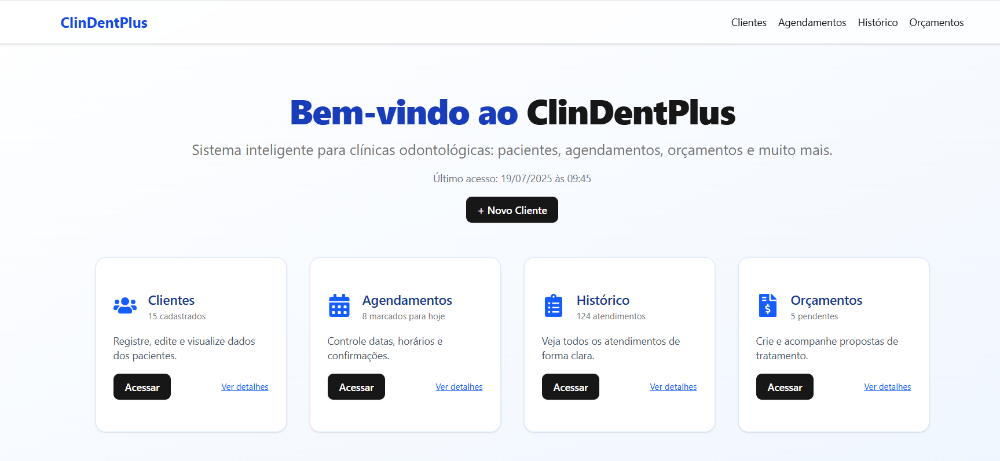

# 🦷 ClinDentPlus

**ClinDentPlus** é um sistema web desenvolvido com **Next.js 14**, **TypeScript** e **TailwindCSS**, projetado para auxiliar clínicas odontológicas no gerenciamento de pacientes, agendamentos, orçamentos e histórico de atendimentos.

 

---

## 🚀 Funcionalidades

- ✅ Cadastro e gerenciamento de **clientes**
- 📅 Controle de **agendamentos** odontológicos
- 💰 Geração e visualização de **orçamentos**
- 🧾 Histórico detalhado de **consultas**
- 📥 Exportação de dados em **CSV**
- 🖨️ Impressão de registros
- 🌙 Suporte a **modo claro/escuro**
- 📱 Layout **responsivo** e adaptável a dispositivos móveis

---

## 🛠️ Tecnologias Utilizadas

| Tecnologia       | Descrição                                 |
|------------------|-------------------------------------------|
| [Next.js 14](https://nextjs.org/)         | Framework React moderno com roteamento e SSR |
| [TypeScript](https://www.typescriptlang.org/)   | Tipagem estática para JavaScript              |
| [TailwindCSS](https://tailwindcss.com/)         | Estilização utilitária com classes CSS        |
| [shadcn/ui](https://ui.shadcn.dev/)             | Componentes acessíveis e estilizados com Radix UI |
| [Lucide Icons](https://lucide.dev/)             | Ícones modernos e leves                       |

---

## 🧩 Estrutura de Pastas

```bash
src/
├── app/                  # Rotas das páginas (Next.js App Router)
│   ├── clientes/         # Página de gerenciamento de clientes
│   ├── agendamentos/     # Página de agendamentos
│   ├── historico/        # Histórico de atendimentos
│   ├── orcamentos/       # Página de orçamentos
│   └── page.tsx          # Página inicial
├── components/
│   └── ui/               # Botões, cards, inputs, etc. (shadcn/ui)
├── styles/
│   └── globals.css       # Estilização global com Tailwind e custom vars
└── plugins/              # Plugin de tema personalizado
```

---

## 📦 Instalação

```bash
# 1. Clone o repositório
git clone https://github.com/SEU_USUARIO/clindentplus.git
cd clindentplus

# 2. Instale as dependências
npm install

# 3. Inicie o servidor local
npm run dev
```

Acesse em `http://localhost:3000`

---

## 🔄 Deploy

Este projeto pode ser facilmente publicado no [Vercel](https://vercel.com):

1. Faça login com GitHub.
2. Importe o repositório.
3. O Vercel detecta automaticamente o framework Next.js.
4. Clique em **Deploy**.

---

## 📄 Licença

Este projeto está sob a licença **MIT**.  
Sinta-se à vontade para usar, modificar e contribuir.

---

## 👨‍💻 Autor

**Danilo Pelaes de Almeida**  
📧 danilopelaes@gmail.com  
🔗 [LinkedIn](https://www.linkedin.com/in/danilo-almeida-00107b64/)  
🌐 [almeida-pranchascientificas.vercel.app](https://almeida-pranchascientificas.vercel.app)

---

> Desenvolvido com dedicação para tornar a gestão de clínicas odontológicas mais moderna e eficiente 🦷
